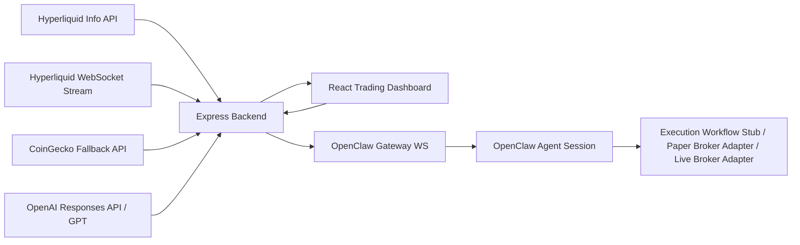

# Architecture



## Current flow
1. frontend requests initial market snapshot from backend
2. backend fetches market context from Hyperliquid info endpoint
3. backend upgrades live candle and asset context through Hyperliquid WebSocket
4. frontend receives live updates through SSE and updates the candlestick chart incrementally
5. frontend requests AI analysis using latest market context
6. backend calls OpenAI Responses API and returns structured trade analysis
7. when execution is triggered, backend forwards the order intent to OpenClaw
8. OpenClaw session acknowledges execution flow and the UI tracks lifecycle state

## Current reality
This project is now beyond a pure hackathon mockup, but it is not yet a safe live-trading system.

Today it is best described as:
- a real market-monitoring terminal
- with live market data and AI-assisted trade planning
- with an execution handoff stub
- ready to be extended into paper trading first, then real execution

## What is real already
- live market feed from Hyperliquid
- fallback market data path
- live chart updates in the frontend
- backend health endpoint
- AI trade analysis path
- execution request lifecycle in the UI

## What still needs to become production-grade
- authenticated exchange/broker adapter
- paper trading ledger and fills
- persistent database for orders, fills, positions, and audit log
- user auth / role separation
- robust risk engine and pre-trade checks
- better reconnect / replay handling for all streams
- monitoring, alerting, and crash recovery

## Suggested roadmap
1. **Paper trading first**
   - simulate orders against live market data
   - store fills, PnL, and positions persistently
2. **Risk engine**
   - max risk per trade
   - daily drawdown limit
   - symbol exposure limit
3. **Execution adapter**
   - one adapter interface
   - implementations for paper / Hyperliquid / CEX later
4. **Persistence**
   - sqlite or postgres for state and audit trail
5. **Operator safety**
   - explicit approval modes
   - order preview
   - fail-closed behavior when market feed is degraded

## Design principles
- operator-first UX
- explainable AI, not black-box output
- modular backend so each integration can evolve independently
- resilient fallback mode for demo reliability
- paper-trading-before-live as the default safety path
```