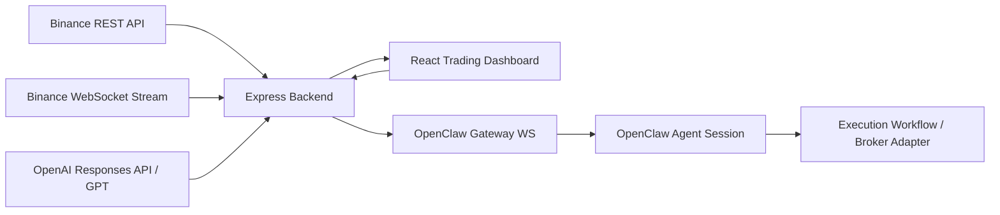

# Architecture



## Flow
1. frontend requests initial market snapshot from backend
2. backend fetches ticker + klines from Binance REST
3. backend upgrades live market updates through Binance WebSocket stream
4. frontend receives live updates through SSE and updates candlestick chart
5. frontend requests GPT analysis using latest market context
6. backend calls OpenAI Responses API and returns structured trade analysis
7. when execution is triggered, backend forwards the order intent to OpenClaw
8. OpenClaw session acknowledges execution flow and the UI tracks lifecycle state

## Design Principles
- simple operator-first UX
- explainable AI, not black-box output
- modular backend so each integration can evolve independently
- resilient fallback mode for demo reliability
```