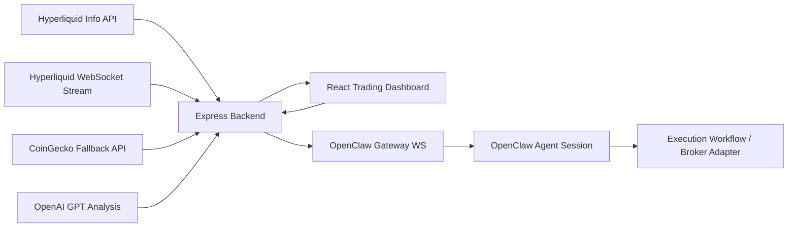

# OpenClaw AI Trader Hackathon Demo

A modern AI-assisted crypto trading terminal that combines:
- **live market monitoring**
- **GPT-based trade intelligence**
- **OpenClaw execution orchestration**
- **clear execution lifecycle tracking**

Built to score well on hackathon judging criteria: **innovation, technical execution, and real-world value**.

---

## Why this project is strong for a hackathon

### Innovation
This is not just a chart dashboard and not just an AI chatbot.
It unifies:
- real-time crypto data
- explainable trade reasoning
- agent-based execution handoff

### Technical Execution
The system includes:
- React frontend
- Express backend
- Hyperliquid REST-style info endpoint + WebSocket data ingestion
- OpenAI GPT analysis
- OpenClaw WebSocket execution bridge
- order lifecycle tracking

### Real-World Value
Traders often need one place to:
- see the market
- understand the trade setup
- execute with confidence

This app is designed around that real workflow.

---

## Features

- **Live candlestick chart** for crypto assets
- **Live market feed** with Hyperliquid primary source, CoinGecko live fallback, and cached snapshot stabilization
- **GPT trade copilot** with:
  - trade summary
  - action recommendation
  - confidence score
  - entry plan
  - stop-loss
  - take-profit
- **OpenClaw execution handoff** for agent-driven execution flow
- **Execution status queue**:
  - submitted
  - approved
  - executed
  - failed
- **Fallback mode** when external APIs are unavailable
- **Modern premium UI** suitable for live judging/demo sessions

---

## Supported Assets
- BTCUSDT
- ETHUSDT
- SOLUSDT
- AVAXUSDT

---

## Stack
- **Frontend:** React + Vite
- **Charting:** lightweight-charts
- **Backend:** Express
- **Market Data:** Hyperliquid info endpoint + Hyperliquid WebSocket + CoinGecko fallback
- **AI:** OpenAI Responses API (GPT)
- **Agent Layer:** OpenClaw Gateway WebSocket

---

## Project Structure

```text
.
├─ src/
│  ├─ components/
│  ├─ hooks/
│  ├─ lib/
│  ├─ App.jsx
│  └─ styles.css
├─ server.js
├─ README.md
├─ PITCH.md
├─ DEMO_SCRIPT.md
└─ ARCHITECTURE.md
```

---

## Deploy to Vercel

### Fastest path
Deploy the **frontend** to Vercel first.

#### 1. Push this repo to GitHub
#### 2. Import project in Vercel
- Framework: **Vite**
- Build command: `npm run build`
- Output directory: `dist`

#### 3. Add environment variable in Vercel
```env
VITE_API_BASE=https://your-backend-url.vercel.app
```

#### 4. Deploy
Vercel will serve the React UI.

### Important note
This repo currently contains:
- a **frontend Vite app**
- a **Node/Express backend** in `server.js`

For the cleanest deployment, use:
- **Vercel** for frontend
- **Railway / Render / another Node host** for backend

That is the most reliable setup for hackathon demo speed.

### Why not put everything on one Vercel project?
You can, but this codebase is currently optimized as a Vite frontend + persistent Node backend. Since the backend handles streaming and runtime state, deploying it separately is safer and simpler.

---

## Run Locally

### 1. Install dependencies
```bash
npm install
```

### 2. Start backend
```bash
npm run server
```

### 3. Start frontend
```bash
npm run dev
```

### 4. Build production
```bash
npm run build
```

---

## Environment Variables
Create a `.env` file if needed:

```env
OPENAI_API_KEY=your_key_here
OPENAI_MODEL=gpt-4o-mini

MARKET_PROVIDER=hyperliquid
HYPERLIQUID_INFO_URL=https://api.hyperliquid.xyz/info
HYPERLIQUID_WS_URL=wss://api.hyperliquid.xyz/ws

OPENCLAW_URL=http://127.0.0.1:18789
OPENCLAW_WS_URL=ws://127.0.0.1:18789
OPENCLAW_GATEWAY_TOKEN=your_gateway_token_if_enabled
OPENCLAW_EXECUTION_SESSION=main

VITE_API_BASE=http://127.0.0.1:8787
```

---

## API Endpoints

### Market
- `GET /api/health`
- `GET /api/market/:symbol`
- `GET /api/stream/:symbol`

### AI
- `POST /api/ai/analyze`

### OpenClaw Execution
- `POST /api/openclaw/execute`
- `GET /api/openclaw/orders`
- `GET /api/openclaw/orders/:id`

---

## Architecture Summary



---

## Demo Narrative
During demo, position the product like this:

1. **Live Market Visibility**
   - show the candlestick chart updating in real time

2. **Explainable AI Reasoning**
   - show GPT-generated trade recommendation and rationale

3. **Action Through OpenClaw**
   - trigger execution and show order queue state changes

This gives judges a complete story:
**observe → understand → execute**

---

## Suggested Talking Points
- The product is designed for **human-in-the-loop trading**, not blind automation.
- GPT improves speed and clarity of decision-making.
- OpenClaw provides the orchestration layer that turns decisions into structured actions.
- The system is modular and can be extended into:
  - paper trading
  - exchange adapters
  - broker APIs
  - approval workflows
  - multi-agent execution

---

## Resilience
If one external service is unavailable:
- market data first falls back to CoinGecko live data
- if providers temporarily fail, the UI can keep showing the latest real cached snapshot
- AI analysis can fall back to mock reasoning
- UI still remains functional for presentation

This makes the project much safer to demo live.

---

## Next Possible Upgrades
- broker or exchange execution adapter
- paper trading mode
- real approval workflow from OpenClaw
- trade journal and history
- portfolio analytics
- multi-timeframe chart analysis
- voice or chat command execution

---

## Submission Assets
Also included in this repo:
- `PITCH.md` → short pitch for judges
- `DEMO_SCRIPT.md` → 3–5 minute demo flow
- `ARCHITECTURE.md` → architecture and system flow

---

## Closing
OpenClaw AI Trader turns market noise into explainable decisions — and decisions into orchestrated action.
